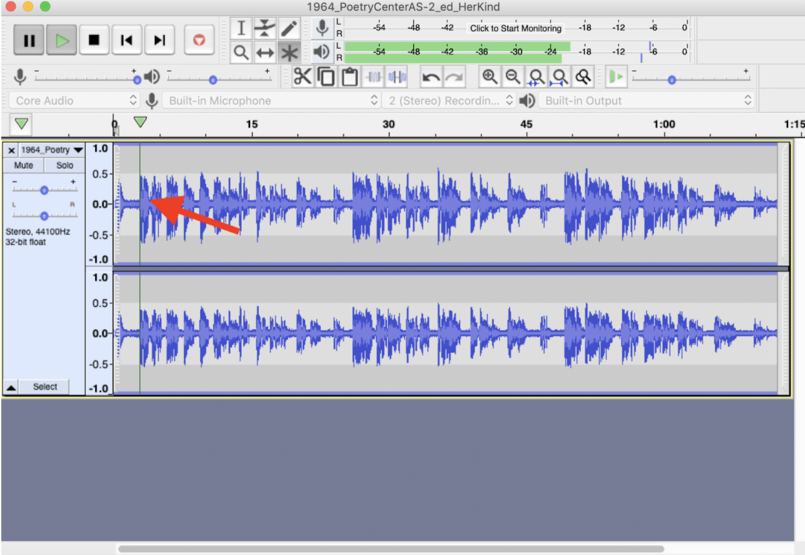
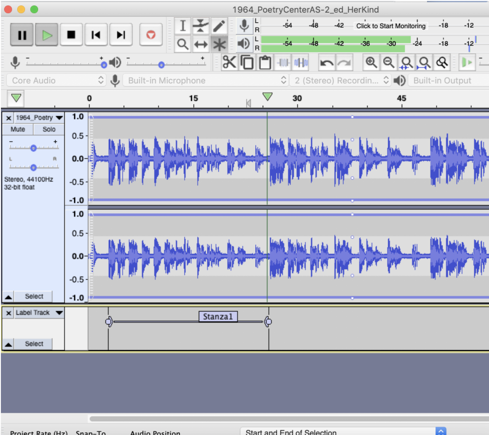

1. [ Downloading Audacity ](#aud)
2. [Audacity to AudiAnnotate](#audtoaa)
3. [Creating Labels in Audacity](#labels)
4. [Exporting Labels From Audacity](#export)
5. [Using AudiAnnotate to Save and Align Labels with Audio](#aa)

### Downloading Audacity

* If you have a mac, navigate to [Audacity's mac download page](https://www.audacityteam.org/download/mac/). There, you'll download the .dmg file and double-click to follow instructions for downloading Audacity to your machine. We recommend downloading the latest version, 2.3.3.

* If you have a pc, navigate to [Audacity's pc download page](https://www.audacityteam.org/download/windows/). There, you'll download the installer and follow instructions for downloading Audacity to your machine. We recommend downloading the latest version, 2.3.3.

### Creating Labels in Audacity

1. Open Audacity, and in the top left, navigate to file→ Open → file name

2. On the warning screen, make sure the make a copy choice is selected, then click ok.

3. There are multiple ways to annotate a stanza. First, we’ll try ranges. To insert a range, you’ll pause the poem by clicking the “p” key when you hear the first line of the stanza begin. 

4. Click the time marker line to mark the place in time where you want to add the label. This typically will correspond to the place where you paused the audio (see image below)

     

5. Then, you’ll click command + b to add a label. A field will pop up, and you can type your annotation. (Example: You may add “Stanza1” to mark the first stanza of a poem.)

    

6. To create the range, you’ll click and drag the right edge of the point to the end of the stanza. You’ll have to play the recording to know where to end the stanza. A completed range will look like this: 

    

7. Those are the basics. Feel free to annotate as you wish, thinking about the issues you run into and what works or doesn’t work for you. 

#### Another way to add labels in Audacity

1. When you open the app and add audio, go to Edit → Labels, then click “Type to create a label”

2. Now as you’re listening, when you type any key, a label will begin

3. Using this method, to pause the audio, you need to use the pause button on the upper left of the interface

### Exporting Labels from Audacity

1. Go to File → Export → Export Labels

2. Name your labels and save as a .txt file. You will need this file when creating your project with the AudiAnnotate application. 

### Using AudiAnnotate to Save and Align Labels with Audio

1\. Navigate to the [AudiAnnotate Application](http://audiannotate.brumfieldlabs.com/)

  * This will prompt you to log in through GitHub (make sure to allow the app to authorize saracarl)

  * Enter your GitHub password to log in

2\. Click "Create New Project"

  * Project ID = repository name (no spaces)

  * Add title and description

3\. Click “Create project”

  * This contacts the github page and  generates repository

4\. Now, on the Audio files page, click “New Item.” This is where you will add metadata for your audio recording.

  * Add label for your audio file
  
  * Add URL for  audio 
  
  * Add duration in seconds
  
  * Other fields are additional metadata from provider
  
5\. Click “Create item” 

6\. Now, on the  annotations page, add a label for your annotations layer. This is where you will upload your .txt labels from Audacity

7\. Click “Choose file”  (.txt labels export from Audacity) 

8\. Click “Add” at the bottom of the page. This will generate your annotations and align them in the IIIF manifest with the audio file. 

9\. From the next screen, you can use the links on the top of the  screen to access your  IIIF manifest and the github pages site. 

10\. Clicking “add” at the bottom of the page allows you to add additional annotation layers to the same audio 

